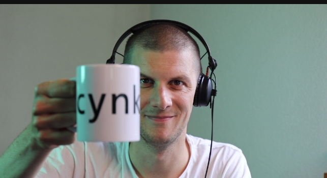
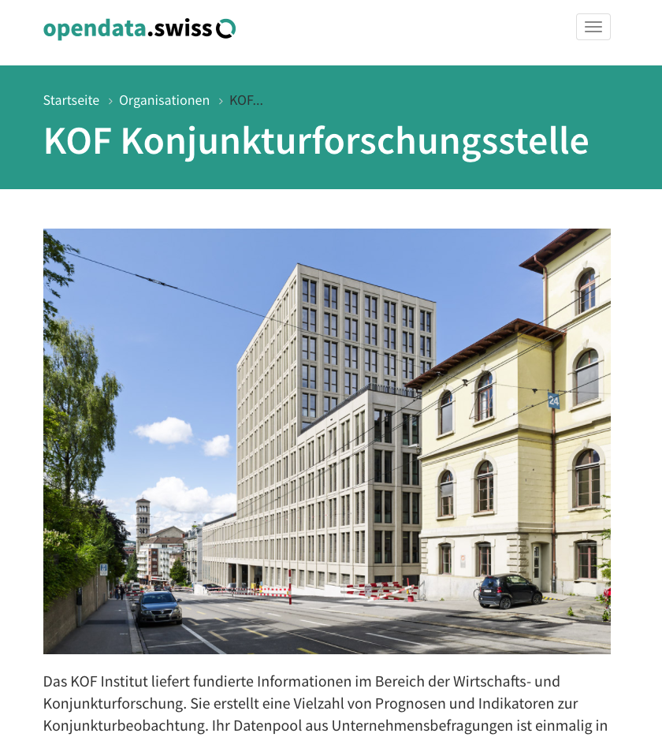
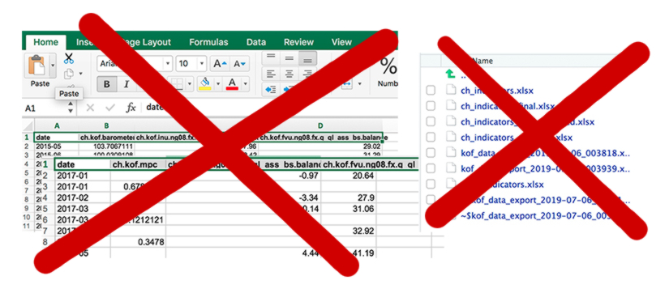

---

output:
  xaringan::moon_reader:
    css: ["robot-fonts","more.css"]
    lib_dir: libs
    nature:
      highlightStyle: github
      highlightLines: true
      highlightSpans: true
      countIncrementalSlides: false
      ratio: '16:9'
      beforeInit: "https://platform.twitter.com/widgets.js"
---

</br>
</br>
</br>
</br>

---


class: center, middle



Hi, I'm Matt. (@whatsgoodio)


<div class="my-footer"><span><div class="footer-text" align="right">These slides and video presentation by Dr. Matthias Bannert are licensed under <a href="https://creativecommons.org/licenses/by-nc-sa/4.0/?ref=chooser-v1">CC BY-NC-SA 4.0</a></div></span></div>

---


class: center, middle


## {kofdata}


<div class="my-footer"><span><div class="footer-text" align="right">These slides and video presentation by Dr. Matthias Bannert are licensed under <a href="https://creativecommons.org/licenses/by-nc-sa/4.0/?ref=chooser-v1">CC BY-NC-SA 4.0</a></div></span></div>

---


class: center, middle


## {kofdata} = 


<div class="my-footer"><span><div class="footer-text" align="right">These slides and video presentation by Dr. Matthias Bannert are licensed under <a href="https://creativecommons.org/licenses/by-nc-sa/4.0/?ref=chooser-v1">CC BY-NC-SA 4.0</a></div></span></div>

---


class: center, middle


## {kofdata} = KOF


<div class="my-footer"><span><div class="footer-text" align="right">These slides and video presentation by Dr. Matthias Bannert are licensed under <a href="https://creativecommons.org/licenses/by-nc-sa/4.0/?ref=chooser-v1">CC BY-NC-SA 4.0</a></div></span></div>

---


class: center, middle


## {kofdata} = KOF + Data


<div class="my-footer"><span><div class="footer-text" align="right">These slides and video presentation by Dr. Matthias Bannert are licensed under <a href="https://creativecommons.org/licenses/by-nc-sa/4.0/?ref=chooser-v1">CC BY-NC-SA 4.0</a></div></span></div>

---

class: center, middle





<div class="my-footer"><span><div class="footer-text" align="right">These slides and video presentation by Dr. Matthias Bannert are licensed under <a href="https://creativecommons.org/licenses/by-nc-sa/4.0/?ref=chooser-v1">CC BY-NC-SA 4.0</a></div></span></div>

---


class: center, middle

```{r, echo=FALSE,warning=FALSE,message=FALSE,fig.width=14}

library(kofdata)
library(tstools)

tsplot(get_time_series("ch.kof.barometer"),
       plot_title = "Example of a Time Series",
       plot_subtitle = "KOF Economic Barometer")


```

<div class="my-footer"><span><div class="footer-text" align="right">These slides and video presentation by Dr. Matthias Bannert are licensed under <a href="https://creativecommons.org/licenses/by-nc-sa/4.0/?ref=chooser-v1">CC BY-NC-SA 4.0</a></div></span></div>


---

class: center, middle




<div class="my-footer"><span><div class="footer-text" align="right">These slides and video presentation by Dr. Matthias Bannert are licensed under <a href="https://creativecommons.org/licenses/by-nc-sa/4.0/?ref=chooser-v1">CC BY-NC-SA 4.0</a></div></span></div>

---

## Basics: Read Time Series into Your R Session

```{r,eval=FALSE}
library(kofdata)
tsl <- `get_time_series("ch.kof.barometer")`
length(tsl)
str(tsl)


```

```{r,echo=FALSE}
library(kofdata)
tsl <- get_time_series("ch.kof.barometer")
length(tsl)
str(tsl)


```

<div class="my-footer"><span><div class="footer-text" align="right">These slides and video presentation by Dr. Matthias Bannert are licensed under <a href="https://creativecommons.org/licenses/by-nc-sa/4.0/?ref=chooser-v1">CC BY-NC-SA 4.0</a></div></span></div>


---

## Basics: Read *Multiple* Time Series into Your R Session

```{r}
labor <- get_time_series(
  c(
    "ch.kof.ie.retro.ch_total.ind.d11",
    "ch.kof.ie.retro.ch_total.ass.d11",
    "ch.kof.ie.retro.ch_total.exp.d11"
    )
  )

str(labor)


```

<div class="my-footer"><span><div class="footer-text" align="right">These slides and video presentation by Dr. Matthias Bannert are licensed under <a href="https://creativecommons.org/licenses/by-nc-sa/4.0/?ref=chooser-v1">CC BY-NC-SA 4.0</a></div></span></div>

---

## Read Meta Information    

```{r}
md <- get_metadata(
  "ch.kof.inu.ng08.fx.q_ql_ass_bs.balance",
  "it"
  )
names(md$ch.kof.inu.ng08.fx.q_ql_ass_bs.balance)
md$ch.kof.inu.ng08.fx.q_ql_ass_bs.balance$variable
md$ch.kof.inu.ng08.fx.q_ql_ass_bs.balance$region


```


<div class="my-footer"><span><div class="footer-text" align="right">These slides and video presentation by Dr. Matthias Bannert are licensed under <a href="https://creativecommons.org/licenses/by-nc-sa/4.0/?ref=chooser-v1">CC BY-NC-SA 4.0</a></div></span></div>

---


## Collections (Formerly known as sets)

```{r}
sets <- list_available_sets()
head(sets)

```


<div class="my-footer"><span><div class="footer-text" align="right">These slides and video presentation by Dr. Matthias Bannert are licensed under <a href="https://creativecommons.org/licenses/by-nc-sa/4.0/?ref=chooser-v1">CC BY-NC-SA 4.0</a></div></span></div>

---


## Collections (Formerly known as sets)

```{r}
sets <- list_available_sets()
head(sets)
list_keys_in_set("ogd_ch.kof.esi")
```


<div class="my-footer"><span><div class="footer-text" align="right">These slides and video presentation by Dr. Matthias Bannert are licensed under <a href="https://creativecommons.org/licenses/by-nc-sa/4.0/?ref=chooser-v1">CC BY-NC-SA 4.0</a></div></span></div>

---


class: center, middle

## DB 


<div class="my-footer"><span><div class="footer-text" align="right">These slides and video presentation by Dr. Matthias Bannert are licensed under <a href="https://creativecommons.org/licenses/by-nc-sa/4.0/?ref=chooser-v1">CC BY-NC-SA 4.0</a></div></span></div>


---


class: center, middle

## DB + Express.io 


<div class="my-footer"><span><div class="footer-text" align="right">These slides and video presentation by Dr. Matthias Bannert are licensed under <a href="https://creativecommons.org/licenses/by-nc-sa/4.0/?ref=chooser-v1">CC BY-NC-SA 4.0</a></div></span></div>


---


class: center, middle

## DB + Express.io + Webserver  ->

## https://...


<div class="my-footer"><span><div class="footer-text" align="right">These slides and video presentation by Dr. Matthias Bannert are licensed under <a href="https://creativecommons.org/licenses/by-nc-sa/4.0/?ref=chooser-v1">CC BY-NC-SA 4.0</a></div></span></div>


---


class: center, middle

## DB + Express.io + Webserver  ->

## https://...


<div class="my-footer"><span><div class="footer-text" align="right">These slides and video presentation by Dr. Matthias Bannert are licensed under <a href="https://creativecommons.org/licenses/by-nc-sa/4.0/?ref=chooser-v1">CC BY-NC-SA 4.0</a></div></span></div>


---


class: center, middle


<div class="my-footer"><span><div class="footer-text" align="right">These slides and video presentation by Dr. Matthias Bannert are licensed under <a href="https://creativecommons.org/licenses/by-nc-sa/4.0/?ref=chooser-v1">CC BY-NC-SA 4.0</a> gif found on Giphy.</div></span></div>

---

class: center, middle


## 1. use {kofdata}!


---

class: center, middle


## 1. use {kofdata}!

## 2. if you are a data provider, consider an API approach


---

class: center, middle

## Dr. Matthias Bannert, KOF Swiss Economic Institute

## @whatsgoodio

## bannert@kof.ethz.ch


