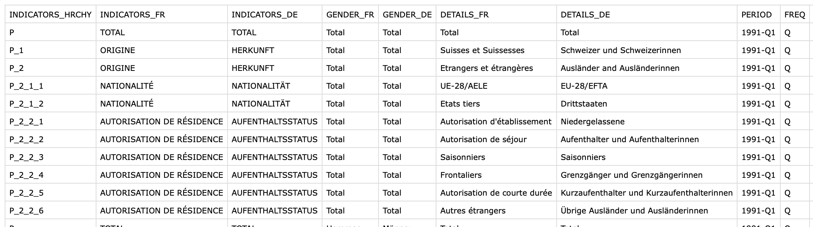
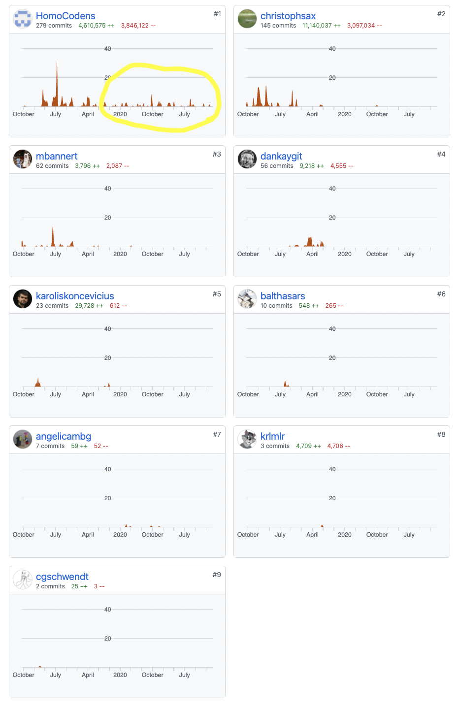

class: center, middle

## Motivation

### Why Revamp swissdata ? 


<div class="my-footer"><span><div class="footer-text" align="right">These slides and video presentation by Dr. Matthias Bannert are licensed under <a href="https://creativecommons.org/licenses/by-nc-sa/4.0/?ref=chooser-v1">CC BY-NC-SA 4.0</a></div></span></div>

---

## 1. New FSO .csv + ODS files


```{r, out.width=800,echo=FALSE}

```

- easier to read maintain
- metadata kept separate by FSO already
- heterogenerous across datasets, but a step towards swissdata format


---


## 2. First Level Support Has Been too Hard to Split


```{r, out.width=400,echo=FALSE}

```


---

## 3. Timing 


Plenty of Funding Opportunities and Partners Available: 

- https://github.com/statistikZH/statbot (collab with FSO, DataShop Kanton ZH, ZHAW)
- Open Science and Open Research Data calls from ETH, Swiss Data Science Center, Swiss Universities 
- FSO very cooperative, in particular w.r.t. to macroeconomic data


---

class: center, middle

## Goals 


---


## 1. Easy Debugging Interactive Use


---

## 2. Facilitate Automation / Production Use


---


## 3. Improve Expandability - Build Community 


---


class: center, middle

## Implementation Strategy


---

## 1. Modularize

- swissdata.core (engine, skeleton/boilerplate, read, write, keep history in folder etc.)
- swissdata.snb, swissdata.fso (pacmans)

(separation of concern, integration of data already in sd format (SECO) and data that needs to be converted)

---

## 2. 5-Star Documentation 

- Project Documentation (swissdata, paired file approach)
- pkgdown for swissdata.core, swissdata.snb etc. 
- common documentation, inheritParams etc. 

---

## 3. Improved Boilerplates

- function skeletons
- more transparent dispatch
- validate functions are key
- guidance in case of dataset issues, help track 'em down

---

class: center, middle

## Roadmap


---

## Milestones


---


## Gantt-Chart


